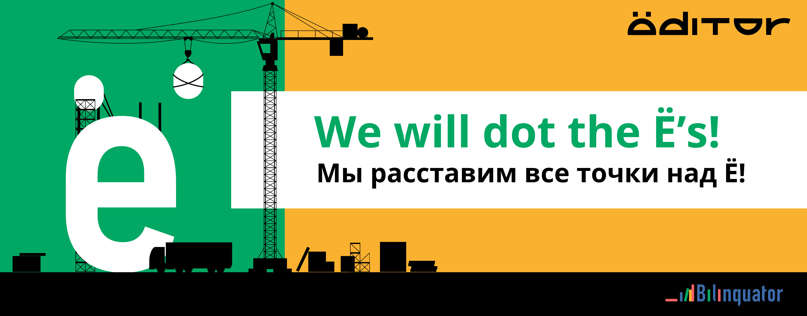

# Ёditor

**Ёditor** is the set of Python functions made to replace `Е` letters in Russian texts to `Ё` letters where it is necessary.

In the Russian language, it is not obligatory to type `Ё` letters with dots. Thus, problem with distinguishing particular words arises. For example, in majority of contexts, the word `все` in Russian means `everybody` while `всё` means `everything`. We think, the `Ё` letter must not be avoided! [Bilinguator.com](https://bilinguator.com/) online library dots all the `Ё`s in its Russian texts with the help of Ёditor.

Packages used in Ёditor: [os](https://docs.python.org/3/library/os.html), [re](https://docs.python.org/3/library/re.html), [tqdm](https://github.com/tqdm/tqdm#readme).

For this repository, the [yobase by Evgeny Minkovsky (Евгений Миньковский) 2003](http://python.anabar.ru/yo.htm) has been utilized. We divided all the word spelled with `Ё` into two files:
* [yobase/yo_sure.txt](yobase/yo_sure.txt) — words **always** spelled with the `Ё` letter;
* [yobase/yo_unsure.txt](yobase/yo_unsure.txt) — words **sometimes** spelled with the `Ё` letter.

According to this division two separate functions have been implemented.

## yoditor.recover_yo_sure
```python
text = yoditor.recover_yo_sure(text)
```


Recover all certain `Ё` in the `text` string. This function does not rewrite a variable — do not forget to redefine it.

* *str* `text` — text where to find and recover certain `Ё` letters;

* return *str* — text with certain `Ё` letters recovered.

## yoditor.recover_yo_unsure

```python
text = yoditor.recover_yo_unsure(text)
```

Recover all uncertain `Ё` in the text in the interaction mode. This function does not rewrite a variable — do not forget to redefine it.
    
* *str* `text` — text where to find and recover uncertain `Ё` letters;
* *int* `print_width` — how many characters to print while interaction (default: 100);
* *str* `yes_reply` — input required to confirm replacement `Е` with `Ё`;
* return *str* — text with uncertain `Ё` letters recovered.

While the function is running, you are asked to choose if there is need to replace the `Е` to `Ё`. A part of the text is shown to comprehend the context, the questionable word is highlighted in bold and red. You can regulate the amount of characters shown specifying in the `print_width` variable. It equals 100 characters by default.

To accept the `Е`-to-`Ё` replacement, type the value of the `yes_reply` argument into the input area. Dy default, it is `ё`, but you can specify another one. If replacement is not needed, type any other string of leave the input area empty. Do not forget to push `Enter` key in each step.

In the example below, replacement is not needed on the first step, that is why no input entered. On all following steps, `ё` is entered because replacement is needed.


